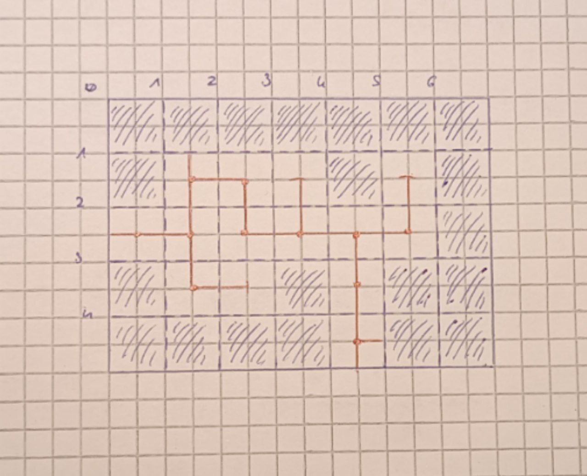

# Gioco

## Obiettivi

Il gioco deve alternare l'esplorazione di mappe fisse con quella di labirinti creati casualmente ad ogni visita, senza che le due modalità appaiano distinte: labirinti e mappe fisse devono divergere solo nella modalità di creazione.

## Storia

### Linee guida

Linee guida per creare una storia:

1. Si segue un personaggio che si muove in una certa traiettoria;

2. Ogni personaggio cambia la propria tratiettoria solo quando incontra qualcosa sulla propria strada;

3. Ogni personaggio dal proprio punto di vista si percepisce come il protagonista;

4. Ogni cosa nella storia è una risposta ad una domanda, ad esempio:

    - Di chi si parla?
    - Cosa vuole?
    - Perché non lo può ottenere?
    - Cosa fanno a riguardo?
    - Perché non funziona?
    - Come finisce?

5. Divisione in:

    - Trama
    - Personaggi
    - Mitologia

### Mitologia

In principio Dio crea ogni cosa: per primi gli angeli che ereditano ognuno parte dell'indole, idee, atteggiamenti e potere del padre. Dio crea degli obiettivi: infatti incarica gli angeli di vegliare sui mondi che ha creato, Dio crea la legge: per questo chiede agli angeli di non interferire con l'esistenza delle creature mortali, Dio crea le gerarchie: dunque chiede agli angeli di considerarsi suoi sottoposti, Dio crea la pace: perché chiede agli angeli di non danneggiare l'un l'altro.

Passano infinità di anni finché un angelo molto curioso seguendo il compito assegnatogli dal padre nota tra tutti un mondo abitato da una specie che attira sempre più la sua attenzione: nonostante le regole impostegli dal padre decide di studiare questa specie e dopo anni di piccole interazioni, sviluppando amicizia verso questa specie, si palesa ed inizia ad insegnarle i segreti del mondo. Un altro angelo accortosi dell'assenza del fratello lo scopre mentre interagisce con dei mortali: infuriato decide di maledire la specie per insegnare una lezione al fratello. L'angelo infuriato divide la specie in più parti che iniziano a farsi la guerra e maledice il mondo in modo che sia per loro un'eterna trappola con lo scopo di catturarli al proprio interno (labirinti casuali). Quando l'angelo aggredito tenta di fronteggiare il fratello i due cominciano a lottare finché l'aggressore non trafigge l'angelo disubbidente con una lancia e lo inchioda sotto terra in profondità a scontare la propria pena (lago di sangue).

> Nota 1: Essendo creature divine, gli angeli hanno una vitalità e una capacità di guarigione illimitate. Un angelo può ferire temporaneamente un suo simile ma non ucciderlo: la lancia ha infatti l'effetto di mantenere la ferita aperta impedendone la guarigione ed essendo inchiodata la vittima non si può liberare della lancia.

Millenni dopo, si dice che un viaggiatore sia sceso sotto una montagna e abbia incontrato l'angelo trafitto. Dopo la scoperta questo viaggiatore e i suoi seguaci hanno iniziato a studiare come lavorare il liquido del lago, dal quale si possono ottenere dei cristalli in grado di ridare la vita, purtroppo sbriciolandosi dopo l'atto. Grazie a questa scoperta l'uomo riesce a conquistare tutte le terre limitrofe ed a costruire un impero, con la capitale situata in cima alla montagna.

### Bozze e idee

In principio Dio crea ogni cosa, per primi gli angeli: suoi figli, che ereditano sue varie caratteristiche. Tutti i fratelli sono figure positive, tranne uno, che per questo viene disprezzato dagli altri. Un giorno gli angeli non potendo uccidere il fratello decidono, stupidamente, di allontanarlo sigillandolo ai confini del creato per l'eternità; uno di questi però provando pena per lui sceglie di subire la stessa punizione, garantendo comunque ai fratelli di non lasciarlo mai più libero. Il piano dopo una lotta disonesta e brutale infine ha successo e i due angeli vengono segregati su un mondo anonimo e insignificante all'interno di una gabbia con l'angelo incarcerato crocifisso.

Dio crea ogni cosa: anche il male, che non può essere eliminato perché da significato al bene; come quest'ultimo da significato al primo. L'angelo punito infatti riesce a liberarsi e attacca il fratello: in preda alla furia lo inchioda a sua volta alla croce, trasforma una parte di sè in una lancia e con questa gli squarcia il ventre. La gabbia degli angeli è una struttura di un materiale inscalfibile; eppure dal ventre dell'angelo ferito ormai inerme: ne sgorga il sangue, che depositandosi sul fondo della gabbia incomincia a scioglierla: le due parti si fondono in un liquido impuro che lentamente forma un lago alla base della grotta che ospita la gabbia.

L'angelo è ora libero, ma indebolito si divide in frammenti dormienti in attesa di poter riacquisire la propria forza.

> Nota 1: Essendo creature divine, gli angeli hanno una vitalità e una capacità di guarigione illimitate. Un angelo può ferire temporaneamente un suo simile ma non ucciderlo: la lancia ha infatti l'effetto di mantenere la ferita aperta impedendone la guarigione e la crocifissione di impedire che la vittima si possa liberare della lancia.

Millenni dopo, si dice che un viaggiatore sia sceso sotto una montagna e abbia incontrato l'angelo trafitto. Dopo la scoperta questo viaggiatore e i suoi seguaci hanno iniziato a studiare come raffinare il liquido del lago, dal quale si possono ottenere due elementi: uno inizialmente considerato di scarto che tende a formare cristalli ed uno invece metallico dalle proprietà meccaniche inimmaginabili. Grazie a questa scoperta l'uomo riesce a conquistare tutte le terre limitrofe ed a costruire un impero, con la capitale situata in cima alla montagna.

Dopo numerosi anni di espansioni territoriali e progresso tecnologico, alcuni maghi imperiali scoprono che i cristalli se di dimensioni sufficientemente grandi permettono di salvare la vita ad una creatura in punto di morte e ripristinarne completamente la salute, distruggendo però il cristallo. Ma non solo: perché i cristalli più piccoli possono invece immagazzinare informazioni e trattenerle per lungo tempo.

> Nota 2: Rimangono ancora inspiegati le distorsioni geografiche e i mostri.

L'obiettivo del giocatore è di riunire i frammenti dell'angelo punito.

L'angelo punito tramite i propri frammenti: ognuno che rappresenta sentimenti negativi distinti, li sfoga spargendo caos. Lui in realtà è pentito delle proprie azioni e vorrebbe ricongiungersi con la propria famiglia, non capisce il motivo per cui è stato allontanato e prova rimorso, rabbia e un senso di abbandono.

Questo simbolicamente rappresenta il fatto che nel bene (cioè in Dio) esiste del male, e nel male (nell'angelo punito) esiste del bene come in un frattale. Ognuno dentro la propria personalità ha dei lati positivi e negativi, che non vanno attaccati o rimossi, ma compresi per riuscire a gestirli.

## Diario

Il diario ha come principale funzione la raccolta di entrate per ogni evento come missioni principali o laterali. Dopo ogni avanzamento sostanzioso in queste attività, le entrate vengono aggiornate. Il diario ha poi una funzione secondaria che è la descrizione dei personaggi incontrati durante l'avventura. Ogni qual volta il giocatore carica la partita può leggere dal diario l'ultimo avanzamento compiuto, oppure entrare direttamente in partita. Durante l'esplorazione ogni azione viene mostrata in una casella di testo, formando uno storico (Nota: sistema di replay).

Per quanto riguarda le informazioni su razze, classi, creature e altro ancora, saranno invece necessari altri strumenti come ad esempio un'enciclopedia o un bestiario.

## Mappa

### Struttura

L'area esplorabile del gioco è organizzata in regioni, che a loro volta sono suddivise in stanze molto ampie, le quali possono collegarsi tra loro solamente lungo i quattro punti cardinali. Dentro ognuna può essere presente al massimo un punto di interesse: al di fuori di un labirinto un punto di interesse può essere ad esempio un negozio di armi o una stazione di viaggio rapido; all'interno invece potrebbe essere un forziere. Ogni livello di profondità di un labirinto è una regione.

Ogni regione possiede la propria mappa, ognuna delle quali può essere prodotta dal giocatore con risultati differenti in base alle proprie capacità; oppure può essere ottenuta nella sua interezza ad esempio acquistandola da un cartografo, depredando un cadavere o altro ancora. Qualsiasi personaggio che non possiede una mappa completa quando esplora vede le stanze inesplorate di un colore, mentre quelle esplorate di un altro, senza altri dettagli; se il giocatore invece può usufruire della cartografia, oltre al colore vede ad esempio anche punti di interesse e la forma delle stanze. Infine, un giocatore con una mappa completa vede tutto quanto già descritto, ma anche per le stanze non ancora visitate. La mappa viene aggiornata solo al momento del salvataggio, quando il personaggio ha del tempo per riposarsi.

Le stanze inesplorate appaiono sempre diverse in un modo o in un altro per aiutare il giocatore a scegliere una strada quando si trova spaesato.

### Aspetto

Quando il giocatore visualizza la mappa come prima cosa vede la regione in cui si trova con tutte le sue stanze, e con un pulsante può invece decidere di vedere la mappa di tutte le regioni; dopodiché può selezionare quale regione osservare più nel dettaglio e vedere la sua mappa. Con un altro pulsante può invece tornare a visualizzare la mappa della regione in cui si trova. La mappa di una regione appare all'incirca in questo modo:

    

Da notare che la stanza `(1, 1)` tradisce un collegamento a nord non ancora esplorato mentre la stanza `(5, 1)` è chiaramente un vicolo cieco.

## Programmazione

### Labirinti

#### Definizioni

Segue una spiegazione dei termini utilizzati nel documento:

| Termine           | Significato                                                           |
| ----------------- | --------------------------------------------------------------------- |
| Intersezione      | Stanza con tre o più uscite.                                          |
| Vicolo cieco      | Stanza con una singola uscita.                                        |
| Serratura         | Contenuto di una stanza che impedisce l'esplorazione.                 |
| Chiave specifica  | Contenuto di una stanza che apre una specifica serratura.             |
| Chiave condivisa  | Contenuto di una stanza che apre una o più serrature.                 |
| Ostacolo          | Contenuto di una stanza che ostacola ma non impedisce l'esplorazione. |
| Punto d'interesse | Contenuto eccezionale di una stanza.                                  |

#### Algoritmo

Un livello di profondità di un labirinto deve presentare sempre una stanza centrale, collegata a vari vicoli ciechi. I corridoi che li collegano possono anche presentare delle diramazioni, ma non dei cicli.

Inizialmente l'algoritmo parte con una griglia vuota di stanze, ognuna poi conterrà il punto cardinale dal quale l'algoritmo ha raggiunto la stanza per la prima volta, ed i punti cardinali lungo i quali la stanza si collega alle altre. Se il punto cardinale d'arrivo non è presente, la stanza non è mai stata raggiunta. L'algoritmo poi esegue una visita della griglia in profondità selezionando ogni volta una stanza ed un punto cardinale casuali. Per concludere, sceglie poi due vicoli ciechi: l'entrata e l'uscita del livello. Nella stanza d'uscita può essere presente un bosso o un mini-boss.

L'algoritmo posiziona una serratura nella stanza d'uscita. Poi per ogni altro vicolo cieco (esclusa l'entrata) decide se inserire un ostacolo, una serratura o se lasciare la stanza vuota, e posiziona anche la chiave della serratura precedente. Infine con lo stesso criterio sceglie una stanza dove posizionare la chiave della serratura appena inserita. Le percentuali di serrature e ostacoli inserite fanno parte delle configurazioni dell'algoritmo. In generale la formula deve rispettare la condizione: `P(ostacoli) + P(serrature) = 1 - P(vuote)`.

Per terminare, percorre tutte le stanze che non sono vicoli ciechi, e con una certa probabilità `P <= 1` la collega ad una adiacente qualsiasi.

##### Aggiunte

Si possono aggiungere corsi d'acqua o altre formazioni che attraversano la mappa prima di piazzare le stanze per far utilizzare le abilità dei personaggi.

### Griglia

`TODO`: spiegare struttura griglia.
