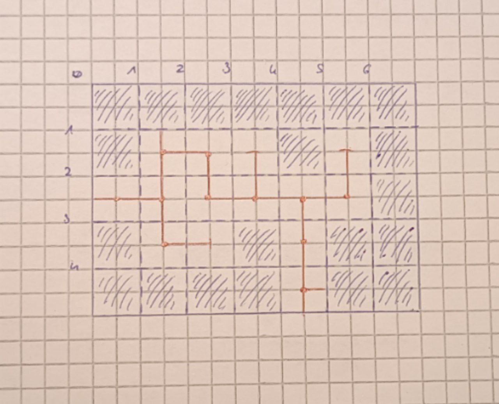

### Mappa

#### Struttura

L'area esplorabile del gioco è organizzata in regioni, che a loro volta sono suddivise in stanze molto ampie, le quali possono collegarsi tra loro solamente lungo i quattro punti cardinali. Dentro ognuna può essere presente al massimo un punto di interesse: al di fuori di un labirinto un punto di interesse può essere ad esempio un negozio di armi o una stazione di viaggio rapido; all'interno invece potrebbe essere un forziere. Ogni livello di profondità di un labirinto è una regione.

Ogni regione possiede la propria mappa, ognuna delle quali può essere prodotta dal giocatore con risultati differenti in base alle proprie capacità; oppure può essere ottenuta nella sua interezza ad esempio acquistandola da un cartografo, depredando un cadavere o altro ancora. Qualsiasi personaggio che non possiede una mappa completa quando esplora vede le stanze inesplorate di un colore, mentre quelle esplorate di un altro, senza altri dettagli; se il giocatore invece può usufruire della cartografia, oltre al colore vede ad esempio anche punti di interesse e la forma delle stanze. Infine, un giocatore con una mappa completa vede tutto quanto già descritto, ma anche per le stanze non ancora visitate. La mappa viene aggiornata solo al momento del salvataggio, quando il personaggio ha del tempo per riposarsi.

Le stanze inesplorate appaiono sempre diverse in un modo o in un altro per aiutare il giocatore a scegliere una strada quando si trova spaesato.

#### Aspetto

Quando il giocatore visualizza la mappa come prima cosa vede la regione in cui si trova con tutte le sue stanze, e con un pulsante può invece decidere di vedere la mappa di tutte le regioni; dopodiché può selezionare quale regione osservare più nel dettaglio e vedere la sua mappa. Con un altro pulsante può invece tornare a visualizzare la mappa della regione in cui si trova. La mappa di una regione appare all'incirca in questo modo:

    

Da notare che la stanza `(1, 1)` tradisce un collegamento a nord non ancora esplorato mentre la stanza `(5, 1)` è chiaramente un vicolo cieco.
